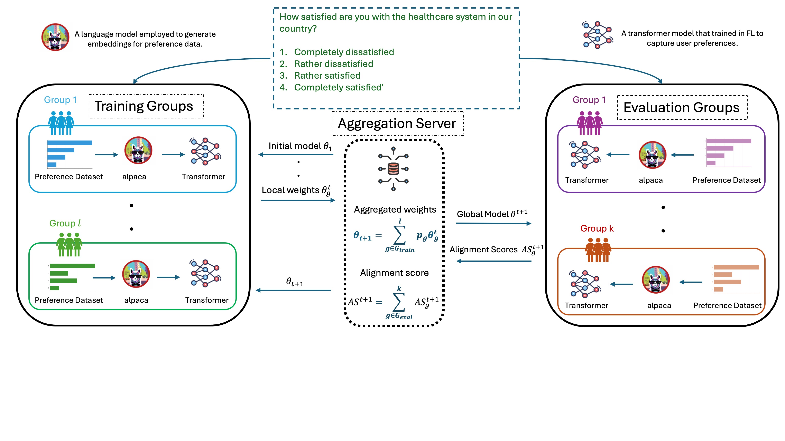

# [PluralLLM: Pluralistic Alignment in LLMs via Federated Learning](https://arxiv.org/abs/2503.09925)

**PluralLLM** is a Federated Learning framework for aligning Large Language Models (LLMs) with diverse human preferences in a privacy-preserving and fairness-aware manner. Built to address the preference data privacy limitations of centralized RLHF (Reinforcement Learning from Human Feedback), PluralLLM enables decentralized training of a transformer-based preference predictor, which can serve directly as a reward model in RLHF pipelines.

Our method uses Federated Averaging (FedAvg) to efficiently aggregate updates from multiple clients, achieving:

* ⚡ **46% faster convergence**

* 🎯 **4% improvement in alignment scores**
*  **⚖️ Nearly the same group fairness as centralized training**

Evaluated on a Q/A preference alignment task, PluralLLM demonstrates that federated preference learning is a scalable, privacy-preserving, and RLHF-compatible solution for aligning LLMs with diverse human values.


# 🚀 Getting Started
Clone the repository

```
git clone https://github.com/MoSrewa/PluralLLM.git
```
Set up the Conda environment from the provided configuration file
```
conda env create -f environment.yml
conda activate pytorch-gpu
```
 ##  Generates Embedding
This project uses the embedding generation approach used in the [Group-Preference-Optimization (GPO)](https://github.com/jamqd/Group-Preference-Optimization). We follow a similar pipeline for extracting preference embeddings from question-answer (Q/A) datasets using instruction-tuned LLMs.

### Dataset
We use the GlobalQA dataset, a diverse Q/A dataset collected from various global sources, to train and evaluate our federated preference model.

✅ The actual embedding for GlobalQA using the Alpaca model has already been generated and is available at [ClickMe](https://drive.google.com/file/d/1TJkjgLped9tTbzUQ8m4vWg6SDo5HUeBQ/view?usp=sharing) and make sure you put it at the following directory

```
data_loaders/llm_embedding/
```

## Train PluralLLM
To train the PluralLLM framework, follow the steps below:

- Review or modify the default training configuration parameters located in: `utils/terminal_configs.py`

- Launch the training process with the following command:
`python main_fl.py`

- Training progress is tracked via Weights & Biases (WandB), including:

    - Training losses for each user group

    - Alignment scores across all groups

Make sure your WandB account is properly set up and authenticated to visualize metrics in real time.


##  📚 Citation
If you find this project helpful, please cite:

Srewa, Mahmoud, Tianyu Zhao, and Salma Elmalaki. "PluralLLM: Pluralistic Alignment in LLMs via Federated Learning." arXiv preprint arXiv:2503.09925 (2025).

##  📖 References
This project builds upon the foundational work presented in:
[Group-Preference-Optimization (GPO)](https://github.com/jamqd/Group-Preference-Optimization)


If you use PluralLLM in your work, we encourage you to also cite the original GPO repository and its authors for their foundational contributions.


## 📄 License
This project is licensed under the MIT License.

## 📬 Contact
Mahmoud Srewa
📧 msrewa@uci.edu

## 🙏 Acknowledgments

This work was conducted at the [Pervasive Autonomy Lab](https://faculty.sites.uci.edu/elmalaki/people/), Department of Electrical and Computer Engineering, University of California, Irvine. We thank the lab team for their valuable discussions and support.
